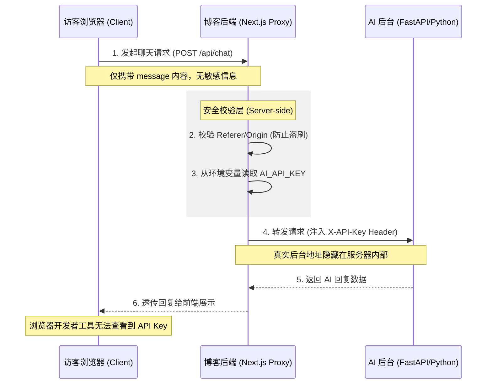

# My AI Blog

本项目基于 [timlrx/tailwind-nextjs-starter-blog](https://github.com/timlrx/tailwind-nextjs-starter-blog) 二次开发，用于快速搭建一个支持多语言（`en` / `zh-CN`）、MDX 写作、搜索与评论的个人博客/技术站点。

## 项目简介

- 技术栈：Next.js（App Router）+ React + TypeScript + Tailwind CSS
- 内容体系：Contentlayer2 驱动的 MDX（Frontmatter + 代码高亮 + 数学公式 + 引用/参考文献等）
- 站点能力：SEO（sitemap/robots）、RSS、暗色模式、站内搜索（kbar）、评论（Giscus，可选）
- 部署方式：目前部署于 Vercel，支持服务端渲染与 API 代理，不再使用静态导出模式

## 主要特性

- App Router 路由结构，按 `app/[locale]/...` 组织多语言页面
- 博客文章按语言放在 `data/blog/<locale>/`，路由中自动去除语言目录（URL 更干净）
- 支持 `.md` / `.mdx`，并内置常用写作增强（GFM、公式、提示块、代码块标题等）
- 生成标签统计与本地搜索索引（构建时产出 `app/tag-data.json` 与 `public/search.json`）
- 可配置的站点信息、导航与社交链接（集中在 `data/` 目录）

## AI Agent 架构设计 (Digital Twin)

本博客不仅是一个静态展示空间，更是站长的 **“数字孪生 (Digital Twin)”** 实验场。通过 **JAMstack** 架构，实现了静态内容与动态智能体的安全集成。

### 核心交互与安全代理流程

为了保障 API Key 的安全并解决跨域问题，项目采用了 **Server-side Proxy (服务端代理)** 模式：



### 设计理念

1. **高性能前端**：基于 Next.js 部署于 Vercel，通过 SSR/ISR 结合静态生成的优势，确保加载速度与 SEO，同时获得服务端能力。
2. **独立大脑 (Independent Brain)**：后端采用 **FastAPI + LangGraph** 架构，部署在独立服务器上，提供无限的执行时长和复杂的智能体推理逻辑。
3. **工具链集成 (MCP)**：深度集成站长的 [fastNotionMCP](https://github.com/whjwjx/fastNotionMCP) 和 [getMyCommits](https://github.com/whjwjx/getMyCommits) 工具，让 AI 助手能够实时读写 Notion 和追踪工程进度。
4. **流式体验**：前端通过 `ReadableStream` 实时处理后端的 Token 输出，实现类似 ChatGPT 的打字机交互体验。

## 目录说明（常用）

- `app/`：页面与路由（含 `api/newsletter`、`sitemap.ts`、`robots.ts`）
- `data/blog/`：博客内容（按 `en/`、`zh-CN/` 分目录）
- `data/authors/`：作者信息（用于 About/作者页等）
- `data/siteMetadata.js`：站点标题、描述、域名、分析/评论/搜索等配置入口
- `components/`、`layouts/`：UI 组件与文章布局
- `public/`：静态资源（图片、favicon、`CNAME` 等）

## 写作与配置速览

### 新增文章

在 `data/blog/zh-CN/` 或 `data/blog/en/` 新建 `*.md(x)` 文件，并在 Frontmatter 中填写基础信息，例如：

```md
---
title: Hello World
date: 2026-03-11
tags: [Next.js, MDX]
summary: 一篇示例文章
draft: false
---
```

### 基础配置

- 修改站点信息：`data/siteMetadata.js`
- 修改导航：`data/headerNavLinks.ts`
- 环境变量：复制 `.env.example` 为 `.env.local`，按需配置 Umami/Giscus 等（可选）

## AI 助手（站内交互）

站点内置一个 Claude Code 风格的浮动终端组件，用于提供“AI 助手”式的站内交互体验（右下角入口）。

- **组件位置**：[ClaudeCodeTerminal.tsx](file:///d:/github_items/nextjs-starter-blog/components/ClaudeCodeTerminal.tsx)（在 [layout.tsx](file:///d:/github_items/nextjs-starter-blog/app/%5Blocale%5D/layout.tsx) 中全站挂载）。
- **当前核心功能**：
  - **作者动态查询**：支持查询站长的实时作息、当前状态（输入 `status`、`now` 或提问“在忙什么？”）。
  - **指令交互**：内置 `help`（帮助）、`schedule`（完整作息表）、`whoami`（身份查询）、`clear`（清空内容）等指令。
  - **基础对话**：支持简单的问候与内置逻辑回复。
- **技术原理**：
  - **本地逻辑优先**：对于预设的指令和状态查询，组件会直接读取 [schedule.ts](file:///d:/github_items/nextjs-starter-blog/data/claude-reference/schedule.ts) 进行响应。
  - **AI 服务转发**：对于非预设指令的通用提问，组件通过 [ai.ts](file:///d:/github_items/nextjs-starter-blog/lib/api/ai.ts) 调用本地 [route.ts](file:///d:/github_items/nextjs-starter-blog/app/api/chat/route.ts) 代理，安全地转发至远程 AI 后台进行回复。
- **自定义方式**：
  - **作息与状态**：在 [schedule.ts](file:///d:/github_items/nextjs-starter-blog/data/claude-reference/schedule.ts) 中修改。
  - **联系方式**：读取 [siteMetadata.js](file:///d:/github_items/nextjs-starter-blog/data/siteMetadata.js) 中的 `email`。
- **关闭方式**：删除 [layout.tsx](file:///d:/github_items/nextjs-starter-blog/app/%5Blocale%5D/layout.tsx) 中的 `<ClaudeCodeTerminal />` 引用与渲染即可。

### AI 后台接入 (Digital Twin)

为了实现更深度的“数字孪生”交互，本项目支持接入外部大模型：
- **安全代理**：前端仅调用站内 `/api/chat`，由服务端注入 `AI_API_KEY` 并转发，确保密钥不泄露。
- **部署要求**：需在 Vercel 或支持 Node.js Server 的环境部署，以运行服务端路由处理器。
- **环境变量**：在部署平台配置 `AI_API_URL` 和 `AI_API_KEY`。

## 快速启动

### 安装依赖

```bash
yarn
```

如果您使用的是 Windows，可能需要运行：

```bash
$env:PWD = $(Get-Location).Path
```

### 本地开发

运行开发服务器：

```bash
yarn dev
```

在浏览器中打开 [http://localhost:3000](http://localhost:3000) 查看结果。

### 生产构建

```bash
yarn build
```

## 许可

[MIT](https://github.com/timlrx/tailwind-nextjs-starter-blog/blob/main/LICENSE) © [Timothy Lin](https://www.timlrx.com)
