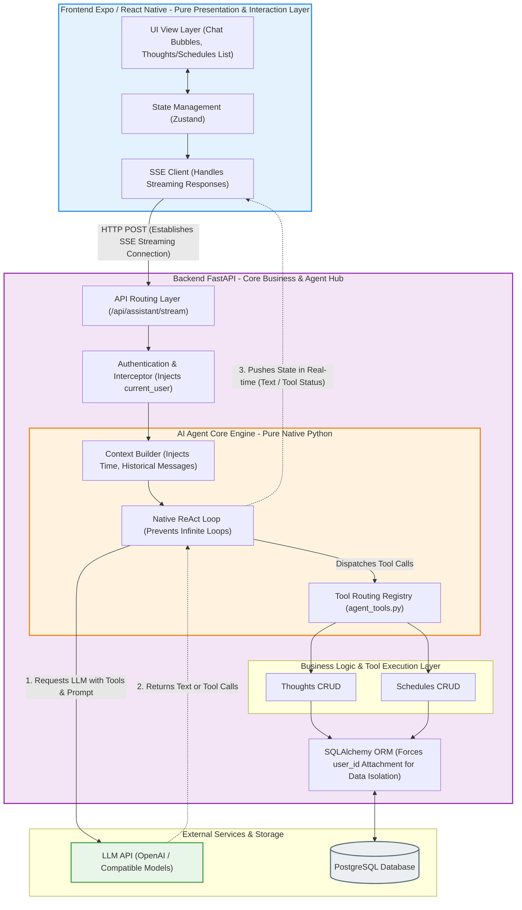

The discussion about AI Agent frameworks seems to never cease. The market is already filled with numerous all-encompassing solutions, resembling towering, precise factories, attempting to lock the uncontrollability of large language models in a cage through layers upon layers of abstraction.

But I always feel that this obsession with complexity might be somewhat superfluous.

When we face a new technology that possesses a certain degree of "common sense" and even "reasoning ability," should we use the mechanical thinking of the old era to frame it, or should we step back and leave it enough space? This is a question I often reflected upon while building **FastXpoAgent**.

FastXpoAgent is not a behemoth born to show off skills. On the contrary, it is a lightweight, multi-user assistant platform built on the AI Agent architecture and the concept of "extreme front-end and back-end separation." Its core design philosophy can actually be condensed into one word: **Restraint**.

## 1. The Separation of "Brain" and "Limbs", Letting the Front-end Become a Pure Executor

In traditional engineering philosophy, the front-end and back-end often each bear a portion of the business logic. But in the AI-native era, FastXpoAgent has made a somewhat resolute cut: the front-end (based on Expo and React Native) has been completely stripped of all business logic.

It no longer needs to judge the user's intentions, nor does it need to handle complex routing distribution. It becomes very pure, serving merely as a "presentation and interaction layer," quietly responsible for cross-platform UI rendering and state management.

All "thinking" and "action" have been pushed down to the Agent hub in the back-end. The ingenuity of this architecture lies in the fact that we no longer use rigid regular expressions or keywords to guess human intentions, but truly let the Large Language Model (LLM) sit in the position of the "Router."

You can look at the architecture diagram below:

In this structure, FastAPI carries the full weight of the business logic and the data isolation for multi-tenancy (PostgreSQL). Everything appears to have a great sense of measure: the systems each perform their own duties without overstepping their bounds.

## Discarding the Cumbersome, The Texture of the Native ReAct Loop

When implementing the core scheduling of an Agent, many people will naturally introduce large frameworks like LangChain. This is understandable. But in FastXpoAgent, I chose pure native Python to implement the ReAct loop.

Why? Because sometimes, excessive encapsulation can obscure the texture of the technology itself. A native implementation is like a piece of hand-polished woodwork; it may not have the intricate carvings of a mass-produced item, but you can truly touch every breath of the Prompt delivery and Tool Calling invocation. It maintains an extreme lightness, and also allows the code to preserve the decency of high cohesion and low coupling.

This attitude of making subtractions is also reflected in the completed MVP features: through natural language, you can easily manage Schedules, record fleeting Thoughts, or trigger web searches when necessary. It is not flashy, but it is sufficiently reliable.

## Composure Towards the Future, Not Just a Tool, But a Digital Twin

Speaking of the future, FastXpoAgent is not in a hurry to cast a wide net. Our subsequent planning still maintains a gentle pace of exploration.

On the one hand, it is the **multi-task collaboration of multiple Agents**. This is not to make the system more complex, but to cope with those intricate problems in the real world, allowing different Agents to act like a tacitly cooperating small think tank, calmly dismantling and executing tasks.

On the other hand, it is **intelligent blog and knowledge base management**. This is perhaps the part I look forward to the most: letting AI silently organize valuable threads during your daily conversations, naturally precipitating them into blog posts. It is no longer just a passively responding tool, but more like a Digital Twin that knows how to listen and record, accompanying you to build a small library of your own amidst the torrent of information.

The development of technology is always changing with each passing day, making it hard to keep up. But in this small world of FastXpoAgent, I hope to guard a sense of tranquility. After all, the best architectures are often not those with the loudest voices, but those that know how to step back and let things grow naturally according to their true nature.
