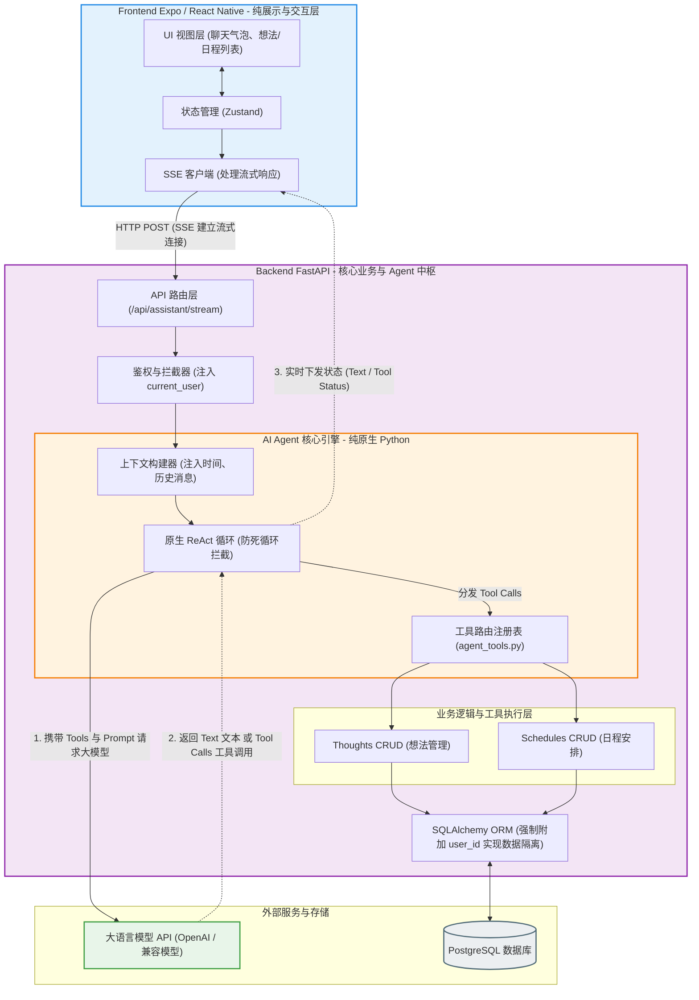

关于 AI Agent 框架的讨论，似乎从未停歇。市面上早已有了诸多大而全的解决方案，它们像是一座座拔地而起的精密工厂，试图用层层叠叠的抽象，把大语言模型的不可控性关在笼子里。

但我总觉得，这种对复杂度的执念，或许有些多余。

当我们面对一种拥有一定“常识”甚至“推理能力”的新技术时，我们到底应该用旧时代的机械思维去框住它，还是应该退后一步，给它留出足够的空间？这便是我在构建 **FastAgent** 时，常常反思的一个问题。

FastAgent 并不是一个为了炫技而生的庞然大物。相反，它是一个基于 AI Agent 架构和“前后端极致分离”理念构建的轻量级多用户助手平台。它的核心设计理念，其实可以浓缩为两个字：**克制**。

## 极致分离，让前端回归纯粹的注视

在传统的工程哲学里，前端和后端往往各自承担着一部分业务逻辑。但在 AI 原生的时代，FastAgent 做出了一种有些决绝的切分：前端（基于 Expo 与 React Native）被彻底剥离了所有的业务逻辑。

它不再需要去判断用户的意图，不再需要去处理复杂的路由分发。它变得非常纯粹，仅仅作为一个“展示层与交互层”，安静地负责跨端 UI 渲染和状态管理。

所有的“思考”与“行动”，都被下沉到了后端的 Agent 中枢。这种架构的精妙之处在于，我们不再用死板的正则表达式或关键词去猜测人心，而是让大语言模型（LLM）真正坐上了“路由器（Router）”的位置。

你可以看看下面这张架构图：

在这个结构里，FastAPI 承载了全量的业务逻辑与多租户（PostgreSQL）的数据隔离。一切显得非常有分寸感：系统各司其职，互不越界。

## 摒弃繁重，原生 ReAct 循环的质感

在实现 Agent 核心调度时，很多人会自然而然地引入诸如 LangChain 这样的大型框架。这无可厚非。但在 FastAgent 中，我选择了纯原生 Python 来实现 ReAct 循环。

为什么呢？因为有时候，过度的封装会让我们看不清技术本身的纹理。原生的实现，就像是一件手工打磨的木器，它也许没有流水线产品那样繁复的雕花，但你却能真切地触摸到 Prompt 传递、Tool Calling 调用的每一次呼吸。它保持了极致的轻量，也让代码维持着高内聚与低耦合的体面。

这种做减法的态度，也体现在已经完成的 MVP 功能上：通过自然语言，你可以轻松管理日程（Schedules），记录稍纵即逝的想法（Thoughts），或者在必要时触发联网搜索。不花哨，但足够可靠。

## 走向未来的从容，不仅是工具，更是数字分身

谈及未来，FastAgent 并没有急于铺开一张大网。我们的后续规划，依然保持着一种温和的探索步调。

一方面，是**多 Agent 的多任务协同**。这并非是为了把系统变得更复杂，而是为了应对真实世界中那些错综复杂的问题，让不同的 Agent 像一个配合默契的小型智库，从容地拆解并执行任务。

另一方面，则是**智能博客与知识库管理**。这或许是我最期待的一部分：让 AI 在与你的日常对话中，默默整理出有价值的脉络，自然而然地沉淀为博客文章。它不再仅仅是一个被动响应的工具，而更像是一个懂得倾听、懂得记录的数字分身（Digital Twin），陪你一起在信息的洪流中，建造一座属于自己的小小图书馆。

技术的发展总是日新月异，令人目不暇接。但在 FastAgent 这个小小的天地里，我更希望能守住一份沉静。毕竟，最好的架构，往往不是那些声音最大的，而是那些懂得退后一步，让事物按照其本真面目自然生长的。
